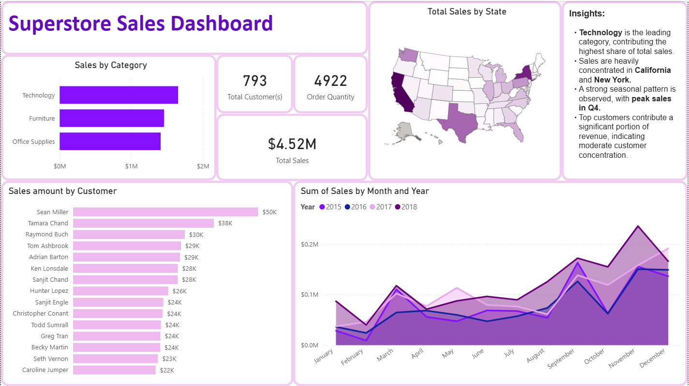
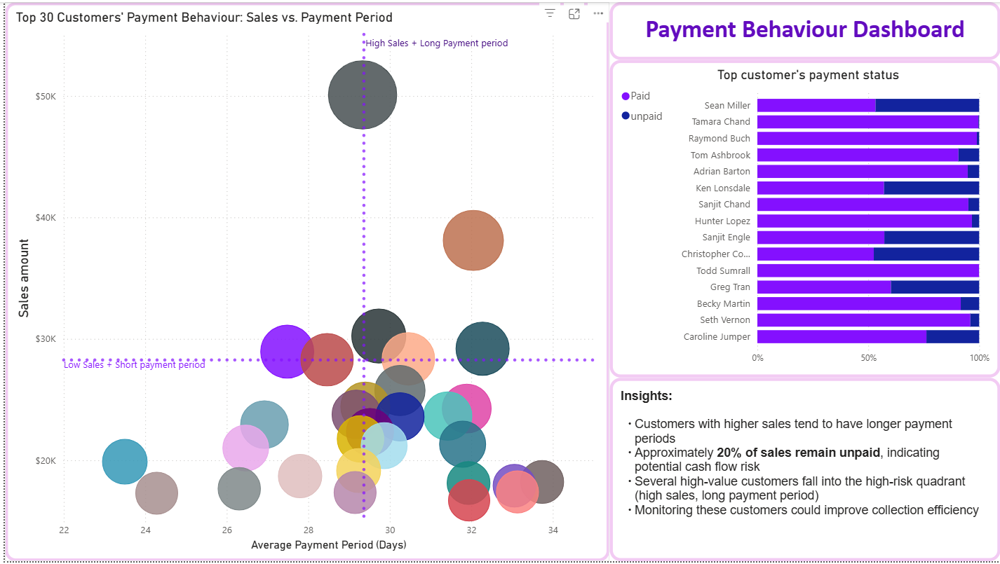

# Mysql_practice_AR_revenue_analysis

## Overview

This project analyzes sales performance and customer payment behaviour using SQL and Power BI.

The goal is to identify key sales trends, customer distribution, and potential financial risks related to delayed payments.

## Tools used

SQL (data cleaning & transformation)

Power BI (data visualization & dashboard)

## Dataset used

The dataset used is "Superstore Sales Dataset" from Kaggle (https://www.kaggle.com/datasets/rohitsahoo/sales-forecasting), it contains fours years of sales transactions including order details, customer information, and etc.

The dataset does not originally contain payment information, they were added via Mysql for payment behaviour analysis using Power BI.

## Power BI Dashboards

## Business Impact

This analysis helps identify high-risk customers and provides insights that can improve cash flow management and sales strategy.
